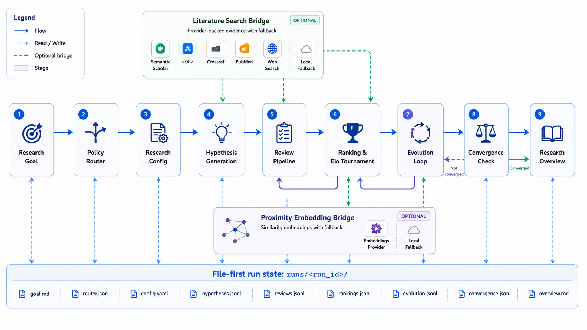
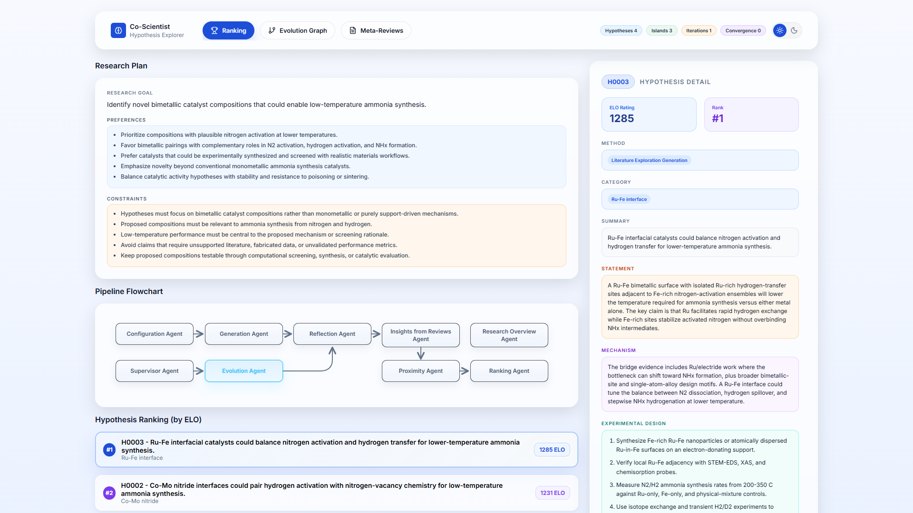

# Co-Scientist

[简体中文](README.zh-CN.md)

Co-Scientist is a repository-local research agent workflow for generating, reviewing, ranking, evolving, and summarizing scientific hypotheses. It is designed for host-agent runtimes such as Claude Code and Codex, while keeping the important state in ordinary files under `runs/<run_id>/`.

The project uses Markdown skills for agent behavior and Python contracts for state, validation, search, embedding, ranking, and dashboard support. The intended user experience is simple: install the environment, install the project-local skills, start a run from a research goal, and inspect the generated artifacts and dashboard receipts.

## Contents

- [Preview](#preview)
- [What It Does](#what-it-does)
- [Quick Start](#quick-start)
- [Requirements](#requirements)
- [Installation](#installation)
- [Start a Run](#start-a-run)
- [User Configuration](#user-configuration)
- [Run Artifacts](#run-artifacts)
- [Dashboard](#dashboard)
- [Validation](#validation)
- [Optional MCP Search Bridge](#optional-mcp-search-bridge)
- [Repository Layout](#repository-layout)
- [Development](#development)
- [Contributing and Security](#contributing-and-security)
- [Citation](#citation)
- [Acknowledgements](#acknowledgements)
- [License](#license)

## Preview

The pipeline overview shows how the host agent moves from a research goal to generation, review, ranking, evolution, convergence, and final synthesis while preserving auditable run artifacts.



The dashboard gives each run a compact view of the research plan, execution status, hypothesis ranking, and selected hypothesis detail.



## What It Does

Co-Scientist runs a structured hypothesis workflow:

1. Configure the research objective and run policy.
2. Generate hypotheses from literature, debate, and assumptions.
3. Review hypotheses with observation, simulation, summary, full-review, and deep-verification passes.
4. Rank hypotheses with pairwise tournament artifacts and Elo-style updates.
5. Evolve promising hypotheses through multiple transformation skills.
6. Maintain a proximity graph when embeddings are enabled.
7. Produce a final research overview after the run reaches a valid completion state.

The workflow is file-first. Skills must write and read canonical artifacts instead of relying on hidden chat memory. Validators check the artifact graph so a run can be inspected, resumed, or repaired.

## Quick Start

This path gets a clean checkout to a first run. Literature search API keys and embedding API keys are optional; without them, the workflow still starts and records auditable degraded receipts when those provider-backed capabilities are unavailable.

### 1. Clone and Install

```powershell
git clone https://github.com/panjose/Co-Scientist.git
cd Co-Scientist
uv sync --extra dev --extra mcp
```

### 2. Install Project-Local Skills

For Claude Code, install the slash-command skill surface.

On Windows:

```powershell
powershell -File tools/install/install_co_scientist.ps1
```

On Unix-like shells:

```bash
bash tools/install/install_co_scientist.sh
```

For Codex, install the project-local `$skill` surface.

On Windows:

```powershell
powershell -File tools/install/install_co_scientist_codex.ps1
```

On Unix-like shells:

```bash
bash tools/install/install_co_scientist_codex.sh
```

### 3. Check the Environment

```powershell
uv run python -m tools.host.project_cli doctor
```

### 4. Start a Run

From Claude Code, open the repository root and use:

```text
/co-scientist-start
```

From Codex, open the repository root and use:

```text
$co-scientist-start
```

Or start directly from the CLI:

```powershell
uv run python -m tools.host.project_cli start --goal "Investigate a plausible mechanism for ammonia synthesis catalyst stability." --budget low --iteration-policy capped --iteration-band 6_10
```

### 5. Open the Dashboard

Use the run directory printed by the start command:

```powershell
uv run python -m tools.host.project_cli dashboard runs/<run_id>
```

Optional provider configuration can be added before step 4 when you want stronger literature coverage or proximity-based ranking. See [User Configuration](#user-configuration) for the search bridge, embedding model, timeouts, and fallback behavior.

## Requirements

- Python 3.12 or newer.
- Conda, `uv`, or another Python environment manager.
- Node.js and `pnpm` for the dashboard.
- Claude Code or Codex for the project-local host-agent skill experience.
- Network access for literature and embedding providers when those optional capabilities are enabled.

## Installation

Python dependencies are declared in `pyproject.toml` and locked in `uv.lock`. For reproducible local setup, use `uv sync`; Conda remains a supported alternative when you prefer managing the Python interpreter yourself.

### Recommended `uv` Setup

```powershell
uv sync --extra dev --extra mcp
```

Use `uv run` for Python commands when using this setup:

```powershell
uv run python -m tools.host.project_cli doctor
```

### Alternative Conda Setup

```powershell
conda create -n co-scientist python=3.12 -y
conda activate co-scientist
python -m pip install -e ".[dev,mcp]"
```

### Dashboard Dependencies

```powershell
pnpm --dir apps/dashboard install
pnpm --dir apps/dashboard build
```

### Project-Local Claude Code Skills

On Windows:

```powershell
powershell -File tools/install/install_co_scientist.ps1
```

On Unix-like shells:

```bash
bash tools/install/install_co_scientist.sh
```

### Project-Local Codex Skills

On Windows:

```powershell
powershell -File tools/install/install_co_scientist_codex.ps1
```

On Unix-like shells:

```bash
bash tools/install/install_co_scientist_codex.sh
```

The Codex installer writes the project-local discovery surface to `.agents/skills/`, records install state in `.co-scientist/installed-codex-skills.json`, and maintains a local `AGENTS.md` managed block. It does not create a project `.codex/` directory by default.

Finally, run the doctor from the environment you will use for Co-Scientist:

```powershell
uv run python -m tools.host.project_cli doctor
```

or, for Conda:

```powershell
conda activate co-scientist
python -m tools.host.project_cli doctor
```

`doctor` checks Python, required runtime packages, dashboard tooling, dashboard install state, Claude Code and Codex skill installation, and the `runs/` directory.

The examples below use `uv run` for Python commands. Conda users can replace `uv run python` with `python` after running `conda activate co-scientist`.

## Start a Run

### Claude Code

After installing the project-local skills, open Claude Code from the repository root and use:

```text
/co-scientist-start
```

Useful entry commands:

```text
/co-scientist-install
/co-scientist-doctor
/co-scientist-params
/co-scientist-start
/co-scientist-dashboard runs/<run_id>
```

### Codex

After installing the project-local Codex skills, open Codex from the repository root and use:

```text
$co-scientist-start
```

Useful entry skills:

```text
$co-scientist-doctor
$co-scientist-params
$co-scientist-start
$co-scientist-dashboard runs/<run_id>
```

### Python CLI

Start directly from the repository root:

```powershell
uv run python -m tools.host.project_cli start --goal "Investigate a plausible mechanism for resistance." --iteration-policy completion_driven
```

For a capped run:

```powershell
uv run python -m tools.host.project_cli start --goal "Investigate a plausible mechanism for resistance." --budget low --iteration-policy capped --iteration-band 6_10
```

Inspect available start controls:

```powershell
uv run python -m tools.host.project_cli params
uv run python -m tools.host.project_cli start --help
```

Core controls:

| Control | Options | Purpose |
| --- | --- | --- |
| `--exploration` | `conservative`, `balanced`, `aggressive` | Controls novelty, diversity, and breadth. |
| `--generation-bias` | `literature_heavy`, `debate_heavy`, `assumptions_heavy`, `mixed` | Biases generation strategy. |
| `--review` | `light`, `standard`, `strict` | Controls review depth and critique strictness. |
| `--budget` | `low`, `medium`, `high` | Controls per-round intensity. |
| `--iteration-policy` | `completion_driven`, `capped` | Chooses semantic stopping or a user-selected iteration cap. |
| `--iteration-band` | `6_10`, `10_14`, `15_20`, `20_30` | Sets the approximate iteration range for capped runs. |
| `--evolution` | `exploit`, `balanced`, `diversify` | Tunes later-stage search behavior. |
| `--stop-policy` | `exploratory`, `standard`, `strict` | Controls how readily convergence can stop the run. |
| `--human-checkpoint` | `auto`, `before_overview`, `before_completion`, `every_major_stage` | Controls when the host should pause for confirmation. |

## User Configuration

Most users only need environment variables plus CLI start controls. Do not edit skill prompts to change providers, models, or run policy.

External API keys are optional for starting and running the workflow. Without literature provider keys, the bridge still attempts supported public metadata providers and records auditable provider receipts. Without an embedding API key, proximity updates record a structured skip receipt and ranking uses the documented fallback path.

### Literature Search Bridge

The literature search bridge calls real public provider APIs and writes auditable evidence artifacts. Skills that need literature grounding must call the canonical bridge; they must not invent papers, DOIs, arXiv IDs, venues, citation counts, or abstracts.

No literature search API key is required for basic use. `OPENALEX_EMAIL` is a contact address for polite provider use, not a secret. `OPENALEX_API_KEY` and `SEMANTIC_SCHOLAR_API_KEY` improve provider reliability and rate limits when available, but the bridge can still run without them. Anonymous access may return fewer results, hit rate limits, or produce a `partial` or `blocked` evidence bundle.

Supported providers:

- `openalex`
- `crossref`
- `europe_pmc`
- `semantic_scholar`
- `arxiv`

Common configuration:

```powershell
$env:OPENALEX_EMAIL="you@example.edu"
$env:OPENALEX_API_KEY="..."                  # optional
$env:SEMANTIC_SCHOLAR_API_KEY="..."          # optional
$env:CO_SCIENTIST_LITERATURE_MAX_RESULTS="10"
$env:CO_SCIENTIST_LITERATURE_TIMEOUT_SECONDS="30"
```

Provider failures are preserved. If at least one provider succeeds, the bridge can return a `partial` evidence bundle. If every provider fails or is skipped, it returns `blocked`, and downstream skills must preserve that state instead of claiming literature grounding.

The bridge writes:

```text
literature/queries/<query_id>/REQUEST.json
literature/queries/<query_id>/PROVIDER_RECEIPTS.json
literature/queries/<query_id>/CANDIDATE_PAPERS.json
literature/queries/<query_id>/VERIFIED_PAPERS.json
literature/queries/<query_id>/EVIDENCE_BUNDLE.json
literature/queries/<query_id>/EVIDENCE_BUNDLE.md
literature/queries/<query_id>/SEARCH_TRACE.jsonl
literature/bundles/<bundle_id>.json
```

The bridge searches provider metadata and abstracts where available. It does not guarantee institutional full-text access, provider uptime, or that a paper supports a fine-grained claim. Use the receipts, verified-paper status, and validation commands to audit coverage.

### Proximity Embedding Model

Proximity embeddings are a run capability. When enabled and configured, viable hypotheses receive embeddings, `state/PROXIMITY_GRAPH.json` is updated, and ranking can use similarity-aware context. If embeddings are unavailable, the run should keep a structured skip or failure receipt and use the documented ranking fallback.

An embedding API key is optional. If no key is configured for the selected provider, the proximity bridge records `skipped_provider_unavailable`, does not write fabricated vectors, and lets ranking continue through the receipt-gated fallback. Set `CO_SCIENTIST_PROXIMITY_ENABLED=false` when you want to disable this capability intentionally.

The provider, model, dimensions, timeout, and provider environment variable names are resolved into `state/RESOLVED_RUN_CONFIG.json` for each run. Resume uses that run-local configuration, so changing shell environment variables later does not silently change the embedding space for an existing run.

Configuration surface:

| Setting | Configured By |
| --- | --- |
| Provider | `openai_compatible`, `gemini` |
| Model | Set with `CO_SCIENTIST_EMBEDDING_MODEL` or use the project default. |
| Dimensions | Set with `CO_SCIENTIST_EMBEDDING_DIMENSIONS` or use the project default. |
| Enabled | `true` |
| Base URL env var | `OPENAI_BASE_URL` for OpenAI-compatible providers; unused for Gemini. |
| API key env var | `OPENAI_API_KEY` for OpenAI-compatible providers; `GEMINI_API_KEY` for Gemini. |

OpenAI-compatible example:

```powershell
$env:OPENAI_API_KEY="..."
$env:OPENAI_BASE_URL="https://your-openai-compatible-endpoint/v1"
$env:CO_SCIENTIST_EMBEDDING_PROVIDER="openai_compatible"
$env:CO_SCIENTIST_EMBEDDING_MODEL="<embedding-model-name>"
$env:CO_SCIENTIST_EMBEDDING_DIMENSIONS="<embedding-dimension-count>"
$env:CO_SCIENTIST_EMBEDDING_TIMEOUT_SECONDS="60"
```

Gemini example:

```powershell
uv sync --extra dev --extra mcp --extra gemini

$env:GEMINI_API_KEY="..."
$env:CO_SCIENTIST_EMBEDDING_PROVIDER="gemini"
$env:CO_SCIENTIST_EMBEDDING_MODEL="gemini-embedding-2"
$env:CO_SCIENTIST_EMBEDDING_DIMENSIONS="768"
$env:CO_SCIENTIST_EMBEDDING_TIMEOUT_SECONDS="60"
```

For Gemini, `CO_SCIENTIST_EMBEDDING_DIMENSIONS` is passed to the provider as `output_dimensionality`. If `GEMINI_API_KEY` or the optional `google-genai` dependency is unavailable, the proximity bridge records `skipped_provider_unavailable` and ranking continues through the documented fallback path.

`CO_SCIENTIST_EMBEDDING_DIMENSIONS` must match the vector size returned by the selected model. If you change either the model or dimensions, start a new run or rebuild the proximity graph.

Advanced provider variable indirection:

```powershell
$env:CO_SCIENTIST_EMBEDDING_BASE_URL_ENV="MY_EMBEDDING_BASE_URL"
$env:CO_SCIENTIST_EMBEDDING_API_KEY_ENV="MY_EMBEDDING_API_KEY"
$env:MY_EMBEDDING_BASE_URL="https://your-openai-compatible-endpoint/v1"
$env:MY_EMBEDDING_API_KEY="..."
```

Disable proximity embeddings explicitly:

```powershell
$env:CO_SCIENTIST_PROXIMITY_ENABLED="false"
```

Do not mix embedding dimensions or models inside the same proximity graph. Start a new run or rebuild the graph if you change the embedding space.

## Run Artifacts

A run is created under `runs/<run_id>/`. The bootstrap writes:

```text
input.md
RUN_POLICY.yaml
state/START_REQUEST.json
state/POLICY_DECISION.json
state/RESOLVED_RUN_CONFIG.json
state/STRATEGY_PLAN.json
```

The configuration stage then materializes:

```text
research_plan/RESEARCH_PLAN.json
```

Later stages write generation, review, ranking, evolution, proximity, literature, dashboard, and overview artifacts. If a run reports `inspect_state` or `validation blocked`, treat it as an artifact consistency issue. Repair the reported drift before resuming or producing a final overview.

## Dashboard

`start`, `run`, and `resume` try to bootstrap the dashboard runtime in the background. Resolve the ready links for a run with:

```powershell
uv run python -m tools.host.project_cli dashboard runs/<run_id>
```

The dashboard receipts are:

```text
runs/<run_id>/dashboard/LINKS.md
runs/<run_id>/dashboard/LINKS.json
```

Use `LINKS.md` as the human-readable receipt and `LINKS.json` as the machine-readable receipt.

## Validation

Validate a run:

```powershell
uv run python -m tools.validation.contract_validation runs/<run_id> --skill co-scientist-pipeline
```

Verify completion readiness:

```powershell
uv run python -m tools.validation.verify_pipeline_completion runs/<run_id> --skill co-scientist-pipeline
```

For literature-heavy runs, check that:

- `PROVIDER_RECEIPTS.json` records attempted providers.
- `EVIDENCE_BUNDLE.json.retrieval_metadata.status` is `succeeded` or `partial`.
- `CANDIDATE_PAPERS.json` contains the papers used by the skill.
- `VERIFIED_PAPERS.json` distinguishes `verified`, `verify_pending`, and `unverified` candidates.
- Retrieval results in downstream artifacts link back to `evidence_bundle_ids` and `literature_query_ids`.

## Optional MCP Search Bridge

The optional MCP server exposes the same canonical literature bridge to MCP-capable hosts. It is a thin transport layer; provider calls, deduplication, verification, bundle construction, and validation remain in the Python packages.

Install optional dependencies:

```powershell
uv sync --extra mcp
```

Run the stdio server from the repository root:

```powershell
uv run python mcp-servers/search-bridge/server.py
```

For Codex, use `templates/codex/config.toml.example` as the MCP config snippet. Copy or merge the `[mcp_servers.co_scientist_search_bridge]` block into your user-level `~/.codex/config.toml`, or add the server through the Codex CLI MCP configuration command. The project installer does not create `.codex/` by default; project-local `.codex/` is only for advanced trusted-project overrides.

Exposed tools:

- `search_literature(run_dir, request, verify=True)`
- `search_start(run_dir, request, verify=True)`
- `search_status(run_dir, job_id)`
- `get_evidence_bundle(run_dir, bundle_id)`
- `verify_literature_candidates(run_dir, query_id)`

See `mcp-servers/search-bridge/README.md` for the request shape and reliability boundary.

## Repository Layout

```text
apps/dashboard/                 Nuxt dashboard
mcp-servers/search-bridge/      Optional MCP transport for literature search
packages/agent_contracts/       Pydantic contracts for run artifacts
packages/agent_mechanics/       Deterministic helpers for search, embeddings, ranking, and selection
packages/agent_support/         Policy resolution, routing, parsing, and shared support
packages/run_artifacts/         Artifact IO and synchronization helpers
skills/                         Agent-readable Markdown skills
templates/                      Run and input templates
tests/                          Pytest coverage
tools/                          CLI, install, dashboard, policy, and validation tools
```

## Development

Install development dependencies:

```powershell
uv sync --extra dev --extra mcp
```

Run the current verification suite:

```powershell
uv run python -m ruff check packages tools mcp-servers tests
uv run python -m ruff format --check packages tools mcp-servers tests
uv run pytest -q
uv pip check
```

Verify the Codex install surface without launching Codex:

```powershell
uv run python -m tools.validation.verify_codex_integration_surface
```

Regenerate dashboard contract artifacts after editing dashboard-facing contracts:

```powershell
uv run python -m packages.dashboard_contracts.export_contract_artifacts
```

Keep code, comments, canonical technical documentation, tests, and skill-facing technical documentation in English. Translations such as `README.zh-CN.md` are allowed, but the English README remains the source of truth.

## Contributing and Security

See [CONTRIBUTING.md](CONTRIBUTING.md) for development setup, verification commands, and pull request expectations.

Please report suspected vulnerabilities privately. See [SECURITY.md](SECURITY.md) for the supported reporting path and credential-handling guidance.

## Citation

If you use this repository in research, cite this project with [CITATION.cff](CITATION.cff) and cite the upstream AI co-scientist work listed below.

## Acknowledgements

This project builds on the public AI co-scientist research direction from Google DeepMind:

- [Co-Scientist: A multi-agent AI partner to accelerate research](https://deepmind.google/blog/co-scientist-a-multi-agent-ai-partner-to-accelerate-research/)
- [Towards an AI co-scientist](https://arxiv.org/abs/2502.18864)

Thanks to [Xinhe Li](https://github.com/Xinhe-Li/) for early pipeline design and implementation work that helped shape the starting point of this repository.

Thanks to the [ARIS project](https://github.com/wanshuiyin/Auto-claude-code-research-in-sleep) for its lightweight skill-workflow ideas around portable, agent-readable research automation.

## License

This repository is licensed under the Apache License 2.0. See [LICENSE](LICENSE).
